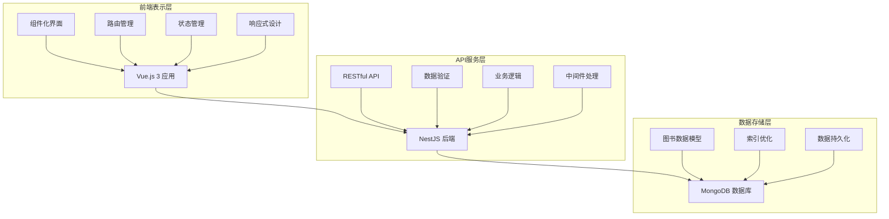
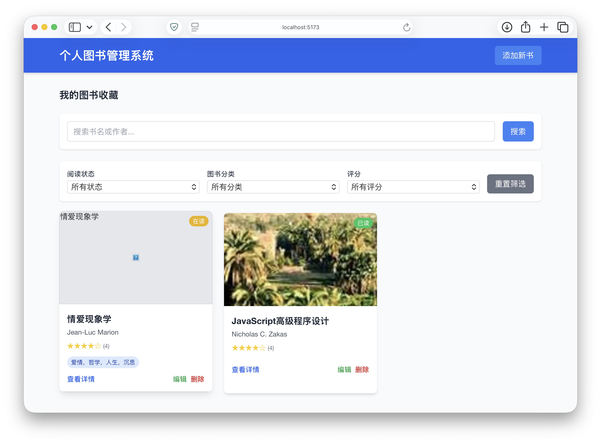
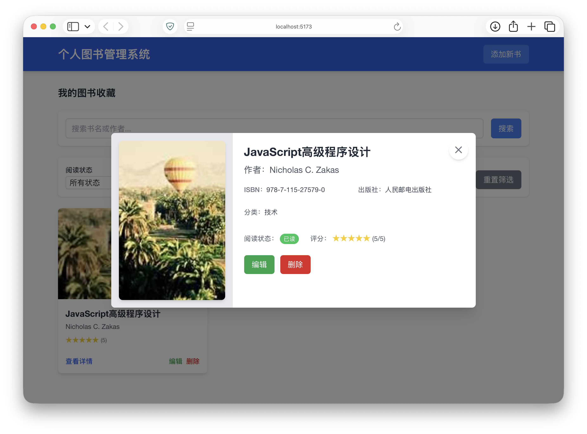
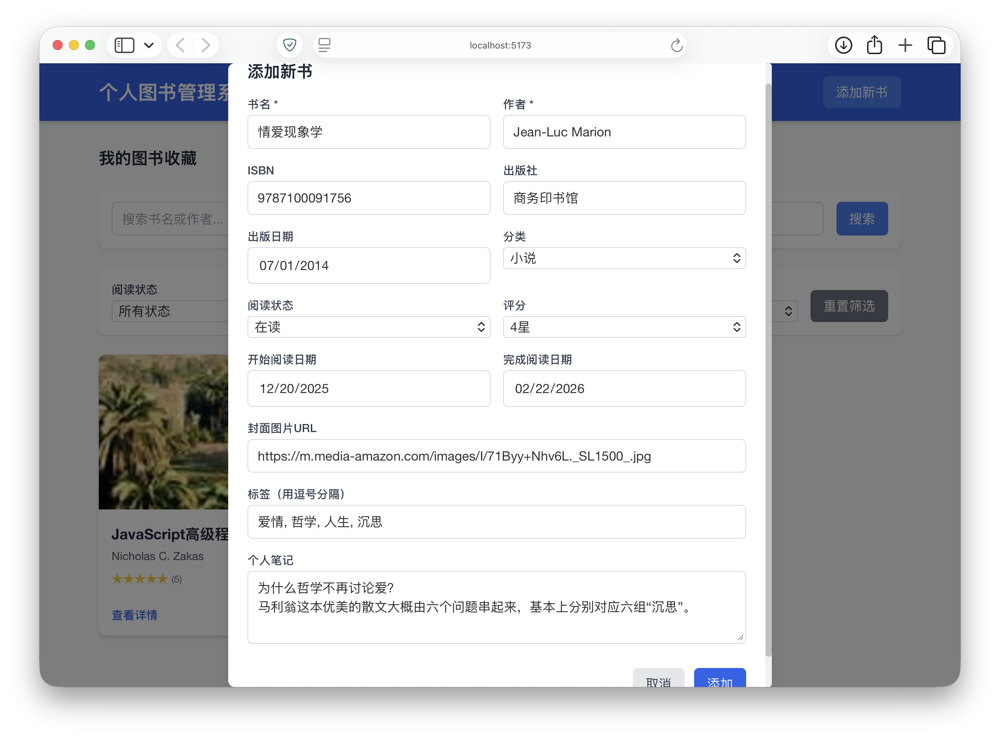
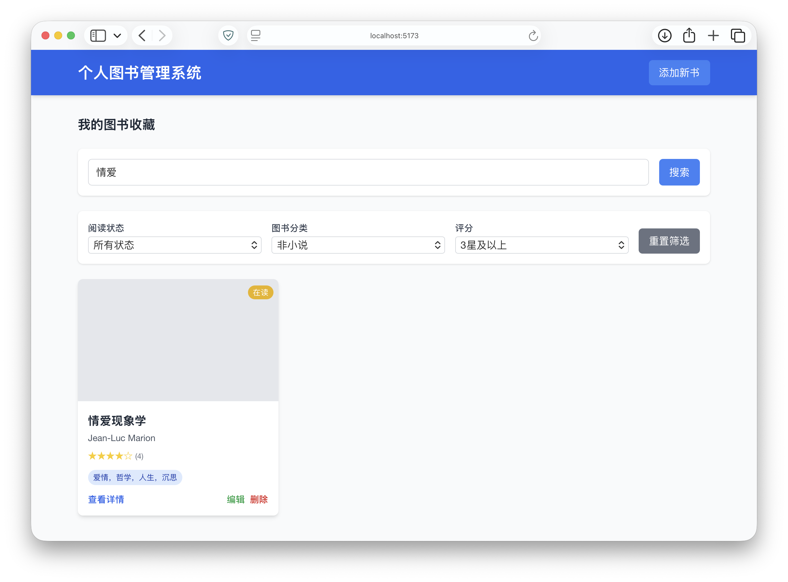

# 个人图书管理系统项目报告

---

## 封面信息

**学期**：2025学年秋季学期  
**课程名称**：Web技术及应用开发  
**指导教师**：陈清毅  
**项目名称**：个人图书管理系统  
**小组成员**：张润泽（20231120231）  
**联系电话**：13669323542  
**电子邮件**：zhangrunze1@stu.ynu.edu.cn  
**报告完成时间**：2025年12月24日  

---

## 1. 需求规格说明

### 1.1 项目背景与目标

随着数字化时代的到来，个人图书收藏管理变得越来越重要。传统的纸质记录方式效率低下，难以检索和统计，而现有的图书管理软件往往功能复杂、操作繁琐，不适合个人用户使用。

本项目旨在开发一个简洁高效的个人图书管理系统，为个人用户提供一个便捷的图书信息管理平台。系统采用现代化的Web技术栈，实现图书信息的全生命周期管理，包括添加、编辑、删除、搜索、筛选等功能，同时支持阅读状态跟踪和个人评价，帮助用户更好地管理自己的图书收藏，记录阅读历程。

### 1.2 用户需求分析

#### 1.2.1 目标用户群体

本系统主要面向以下用户群体：
- 个人图书收藏爱好者
- 需要管理大量图书的学生和研究人员
- 希望记录阅读历程的读者
- 需要图书分类和检索的专业人士

#### 1.2.2 用户使用场景

1. **图书录入场景**：用户购买新书后，需要录入图书的基本信息，包括书名、作者、ISBN、出版社等，并可能添加个人标签和笔记。

2. **阅读管理场景**：用户在阅读过程中需要更新图书的阅读状态，记录开始阅读日期和完成日期，并可能添加阅读心得。

3. **图书检索场景**：用户在需要查找特定图书时，可以通过书名、作者、标签等多种方式进行搜索和筛选。

4. **统计分析场景**：用户希望了解自己的阅读情况，包括已读图书数量、阅读进度、评分分布等统计信息。

#### 1.2.3 用户核心需求

1. **易用性需求**：界面简洁直观，操作流程清晰，无需学习成本即可快速上手。

2. **功能性需求**：提供完整的图书信息管理功能，支持多种检索和筛选方式。

3. **性能需求**：响应迅速，操作流畅，即使在大量数据的情况下也能保持良好的用户体验。

4. **兼容性需求**：支持多种设备和浏览器，随时随地访问和管理图书信息。

### 1.3 功能需求规格

#### 1.3.1 核心功能需求

**FR1：图书信息管理**
- FR1.1：添加新图书，支持手动输入和ISBN自动获取
- FR1.2：编辑图书信息，包括基本信息、个人标签和笔记
- FR1.3：删除图书，支持单个删除和批量删除
- FR1.4：查看图书详情，展示完整信息和统计数据

**FR2：阅读状态管理**
- FR2.1：标记阅读状态（未读/在读/已读）
- FR2.2：记录开始阅读日期
- FR2.3：记录完成阅读日期
- FR2.4：计算阅读进度和阅读时长

**FR3：个人评价系统**
- FR3.1：图书评分（1-5星）
- FR3.2：添加个人笔记和读后感
- FR3.3：添加自定义标签
- FR3.4：管理标签分类

**FR4：搜索与筛选功能**
- FR4.1：按书名、作者进行关键词搜索
- FR4.2：按分类、阅读状态进行筛选
- FR4.3：按评分范围进行筛选
- FR4.4：组合多个条件进行高级搜索

#### 1.3.2 非功能性需求

**NFR1：性能需求**
- NFR1.1：页面加载时间不超过2秒
- NFR1.2：搜索响应时间不超过500毫秒
- NFR1.3：支持至少1000本图书的流畅管理

**NFR2：可用性需求**
- NFR2.1：界面响应式设计，适配桌面和移动设备
- NFR2.2：操作流程不超过3步完成核心功能
- NFR2.3：提供操作反馈和错误提示

**NFR3：兼容性需求**
- NFR3.1：支持主流浏览器（Chrome、Firefox、Safari、Edge）
- NFR3.2：适配不同屏幕尺寸（320px-1920px）
- NFR3.3：支持触摸和鼠标交互

**NFR4：安全性需求**
- NFR4.1：数据输入验证和过滤
- NFR4.2：敏感数据加密存储

### 1.4 系统边界与约束

#### 1.4.1 系统边界

本系统专注于个人图书管理，不包含以下功能：
- 用户注册和登录系统
- 图书社交分享功能
- 图书电子商务功能
- 多用户协作管理

#### 1.4.2 技术约束

- 使用现代前端框架（Vue.js/React/Angular/Svelte）
- 采用前后端分离架构
- 后端基于Web技术实现（如Node.js）
- 实现RESTful API设计
- 使用现代CSS框架（如Tailwind CSS）

#### 1.4.3 业务约束

- 系统为单用户设计，不支持多用户管理
- 数据存储在本地数据库，不支持云端同步
- 图书封面图片仅支持URL引用，不支持本地上传

---

## 2. 系统构架设计

### 2.1 技术路线选择

#### 2.1.1 前端技术体系

本系统前端采用Vue.js 3作为核心框架，基于以下考虑：

1. **渐进式框架**：Vue.js 3采用渐进式设计理念，可以逐步应用到项目中，学习成本低
2. **组件化开发**：支持高度组件化开发，提高代码复用性和可维护性
3. **响应式数据绑定**：提供强大的响应式系统，简化数据状态管理
4. **性能优化**：Vue.js 3引入了虚拟DOM和编译时优化，提供更佳性能

配套技术选择：
- **构建工具**：Vite，提供快速的开发服务器和构建体验
- **样式框架**：Tailwind CSS，实用优先的CSS框架，快速构建响应式界面
- **HTTP客户端**：Axios，支持请求拦截、响应处理和错误处理
- **路由管理**：Vue Router，处理单页应用的路由导航
- **状态管理**：Pinia，轻量级状态管理库

#### 2.1.2 后端技术体系

后端采用NestJS框架，基于TypeScript开发，选择理由如下：

1. **企业级架构**：NestJS提供完整的企业级应用架构，支持模块化开发
2. **TypeScript支持**：原生支持TypeScript，提供强类型检查和更好的开发体验
3. **装饰器语法**：采用装饰器语法简化路由定义和依赖注入
4. **丰富的生态系统**：与多种数据库和ORM无缝集成

配套技术选择：
- **数据库**：MongoDB，文档型数据库，适合存储图书信息的半结构化数据
- **ODM**：Mongoose，提供MongoDB的对象建模和类型转换
- **API文档**：Swagger，自动生成和维护API文档
- **数据验证**：class-validator，提供基于装饰器的数据验证
- **日志系统**：Winston，结构化日志记录

### 2.2 系统整体架构

本系统采用前后端分离的三层架构模式，实现了高内聚、低耦合的设计原则：



*图1：系统整体架构图*

该架构具有以下特点：
1. **分层清晰**：前端、后端、数据层职责明确，便于维护和扩展
2. **组件化设计**：前端采用Vue.js 3组件化开发，提高代码复用性
3. **RESTful API**：后端提供标准的RESTful接口，便于前端调用和测试
4. **数据模型统一**：前后端使用统一的数据模型，减少数据转换开销
5. **响应式设计**：前端界面支持多设备适配，提供一致的用户体验

### 2.3 数据交换方式

#### 2.3.1 前后端通信协议

前后端采用HTTP/HTTPS协议进行通信，数据格式为JSON：

1. **请求格式**：
   - 请求头：Content-Type: application/json
   - 请求体：JSON格式的数据对象
   - 认证信息：Bearer Token（预留扩展）

2. **响应格式**：
   - 成功响应：HTTP 200 + JSON数据
   - 错误响应：HTTP 4xx/5xx + 错误信息
   - 统一响应格式：{ success: boolean, data: any, message: string }

#### 2.3.2 API设计规范

遵循RESTful API设计原则：

- 资源导向：使用名词表示资源，如/books、/categories
- HTTP方法：GET（查询）、POST（创建）、PUT/PATCH（更新）、DELETE（删除）
- 状态码：正确使用HTTP状态码表示操作结果
- 版本控制：通过URL路径进行版本管理，如/api/v1/books

### 2.4 认证与安全机制

#### 2.4.1 当前安全措施

由于系统为单用户设计，当前实现的安全措施包括：

1. **CORS配置**：限制允许的来源域名
2. **数据验证**：前后端双重数据验证
3. **输入过滤**：防止XSS和SQL注入攻击
4. **错误处理**：避免敏感信息泄露

#### 2.4.2 预留认证机制

为未来扩展预留认证机制：

1. **JWT Token**：基于JSON Web Token的无状态认证
2. **API密钥**：用于第三方集成的API访问控制
3. **权限控制**：基于角色的访问控制（RBAC）

### 2.5 部署架构

开发环境采用本地部署模式：

```
开发机器
├── 前端开发服务器 (localhost:5173)
│   ├── Vue.js 3 应用
│   ├── Vite 开发服务器
│   └── 热重载功能
└── 后端开发服务器 (localhost:3000)
    ├── NestJS 应用
    ├── MongoDB 数据库
    └── Swagger API文档
```

### 2.6 数据模型设计

#### 2.6.1 核心数据模型

```typescript
// 图书数据模型
interface Book {
  _id: ObjectId;           // 唯一标识
  title: string;           // 图书标题（必填）
  author: string;          // 作者（必填）
  isbn?: string;           // ISBN号码（可选）
  publisher?: string;      // 出版社（可选）
  publishDate?: Date;      // 出版日期（可选）
  category?: string;       // 分类（可选）
  tags?: string[];         // 标签数组（可选）
  status: 'unread' | 'reading' | 'read';  // 阅读状态（必填）
  rating?: number;         // 评分 1-5（可选）
  notes?: string;          // 个人笔记（可选）
  startDate?: Date;        // 开始阅读日期（可选）
  finishDate?: Date;       // 完成阅读日期（可选）
  coverImage?: string;     // 封面图片URL（可选）
  createdAt: Date;         // 创建时间（自动生成）
  updatedAt: Date;         // 更新时间（自动更新）
}
```

#### 2.6.2 数据库索引策略

为了提高查询性能，设计以下索引：

```typescript
// MongoDB 索引设计
db.books.createIndex({ "title": "text", "author": "text" });  // 全文搜索索引
db.books.createIndex({ "category": 1 });                      // 分类索引
db.books.createIndex({ "status": 1 });                        // 状态索引
db.books.createIndex({ "rating": 1 });                        // 评分索引
db.books.createIndex({ "tags": 1 });                          // 标签索引
db.books.createIndex({ "createdAt": -1 });                    // 创建时间索引
```

### 2.7 性能优化策略

#### 2.7.1 前端性能优化

1. **代码分割**：按路由和组件进行代码分割，减少初始加载时间
2. **图片优化**：使用WebP格式和懒加载技术
3. **缓存策略**：合理使用浏览器缓存和Service Worker
4. **虚拟滚动**：大量数据时使用虚拟滚动技术

#### 2.7.2 后端性能优化

1. **数据库优化**：合理设计索引，使用聚合管道优化复杂查询
2. **缓存机制**：使用Redis缓存热点数据
3. **连接池**：数据库连接池管理
4. **压缩传输**：启用Gzip压缩减少传输数据量

---

## 3. API设计及实现

### 3.1 API设计原则

本系统API设计遵循以下原则：

1. **RESTful架构**：采用资源导向的设计，使用标准HTTP方法表示操作类型
2. **统一响应格式**：所有API响应采用统一的JSON格式，便于前端处理
3. **版本控制**：通过URL路径进行版本管理，确保向后兼容性
4. **错误处理**：使用标准HTTP状态码和详细的错误信息
5. **安全性**：实现数据验证、输入过滤和CORS配置

### 3.2 API接口设计

#### 3.2.1 图书管理核心接口

**获取图书列表**
```
GET /api/books
Query Parameters:
  - page: number (页码，默认1)
  - limit: number (每页数量，默认10)
  - sort: string (排序字段，默认createdAt)
  - order: 'asc' | 'desc' (排序方向，默认desc)

Response:
{
  "success": true,
  "data": {
    "books": Book[],
    "total": number,
    "page": number,
    "limit": number
  },
  "message": "获取图书列表成功"
}
```

**获取单本图书详情**
```
GET /api/books/:id

Response:
{
  "success": true,
  "data": Book,
  "message": "获取图书详情成功"
}
```

**添加新图书**
```
POST /api/books
Content-Type: application/json

Request Body:
{
  "title": string (必填),
  "author": string (必填),
  "isbn": string (可选),
  "publisher": string (可选),
  "publishDate": string (可选),
  "category": string (可选),
  "tags": string[] (可选),
  "status": 'unread' | 'reading' | 'read' (默认unread),
  "rating": number (1-5, 可选),
  "notes": string (可选),
  "coverImage": string (可选)
}

Response:
{
  "success": true,
  "data": Book,
  "message": "添加图书成功"
}
```

**更新图书信息**
```
PATCH /api/books/:id
Content-Type: application/json

Request Body: Partial<Book>

Response:
{
  "success": true,
  "data": Book,
  "message": "更新图书成功"
}
```

**删除图书**
```
DELETE /api/books/:id

Response:
{
  "success": true,
  "data": null,
  "message": "删除图书成功"
}
```

#### 3.2.2 搜索和筛选接口

**搜索图书**
```
GET /api/books/search/:query
Query Parameters:
  - page: number
  - limit: number

Response:
{
  "success": true,
  "data": {
    "books": Book[],
    "total": number,
    "query": string,
    "page": number,
    "limit": number
  },
  "message": "搜索完成"
}
```

**按分类获取图书**
```
GET /api/books/category/:category
Query Parameters:
  - page: number
  - limit: number

Response:
{
  "success": true,
  "data": {
    "books": Book[],
    "total": number,
    "category": string,
    "page": number,
    "limit": number
  },
  "message": "按分类获取图书成功"
}
```

**按阅读状态获取图书**
```
GET /api/books/status/:status
Query Parameters:
  - page: number
  - limit: number

Response:
{
  "success": true,
  "data": {
    "books": Book[],
    "total": number,
    "status": string,
    "page": number,
    "limit": number
  },
  "message": "按状态获取图书成功"
}
```

**按评分范围获取图书**
```
GET /api/books/rating-range
Query Parameters:
  - min: number (最低评分)
  - max: number (最高评分)
  - page: number
  - limit: number

Response:
{
  "success": true,
  "data": {
    "books": Book[],
    "total": number,
    "ratingRange": { min: number, max: number },
    "page": number,
    "limit": number
  },
  "message": "按评分范围获取图书成功"
}
```

#### 3.2.3 统计分析接口

**获取统计信息**
```
GET /api/books/statistics/summary

Response:
{
  "success": true,
  "data": {
    "totalBooks": number,
    "unreadCount": number,
    "readingCount": number,
    "readCount": number,
    "averageRating": number,
    "categoryDistribution": { [category: string]: number },
    "recentlyAdded": Book[],
    "readingProgress": {
      "thisMonth": number,
      "thisYear": number
    }
  },
  "message": "获取统计信息成功"
}
```

### 3.3 后端实现

#### 3.3.1 NestJS模块结构

后端采用NestJS的模块化架构，主要模块结构如下：

```typescript
// app.module.ts - 应用根模块
@Module({
  imports: [
    MongooseModule.forRoot(process.env.MONGODB_URI),
    BookModule,
    ConfigModule.forRoot({
      isGlobal: true,
    }),
  ],
  controllers: [AppController],
  providers: [AppService, BookDatabaseInitService],
})
export class AppModule {}

// book.module.ts - 图书模块
@Module({
  imports: [
    MongooseModule.forFeature([{ name: 'Book', schema: BookSchema }]),
  ],
  controllers: [BookController],
  providers: [BookService],
  exports: [BookService],
})
export class BookModule {}
```

#### 3.3.2 数据模型与验证

```typescript
// book.schema.ts - MongoDB数据模型
@Schema({ timestamps: true })
export class Book {
  @Prop({ required: true })
  title: string;

  @Prop({ required: true })
  author: string;

  @Prop()
  isbn: string;

  @Prop()
  publisher: string;

  @Prop()
  publishDate: Date;

  @Prop()
  category: string;

  @Prop([String])
  tags: string[];

  @Prop({ enum: ['unread', 'reading', 'read'], default: 'unread' })
  status: 'unread' | 'reading' | 'read';

  @Prop({ min: 1, max: 5 })
  rating: number;

  @Prop()
  notes: string;

  @Prop()
  startDate: Date;

  @Prop()
  finishDate: Date;

  @Prop()
  coverImage: string;
}

// create-book.dto.ts - 创建图书数据传输对象
export class CreateBookDto {
  @IsNotEmpty()
  @IsString()
  title: string;

  @IsNotEmpty()
  @IsString()
  author: string;

  @IsOptional()
  @IsString()
  isbn?: string;

  @IsOptional()
  @IsString()
  publisher?: string;

  @IsOptional()
  @IsDateString()
  publishDate?: string;

  @IsOptional()
  @IsString()
  category?: string;

  @IsOptional()
  @IsArray()
  @IsString({ each: true })
  tags?: string[];

  @IsOptional()
  @IsEnum(['unread', 'reading', 'read'])
  status?: 'unread' | 'reading' | 'read';

  @IsOptional()
  @IsInt()
  @Min(1)
  @Max(5)
  rating?: number;

  @IsOptional()
  @IsString()
  notes?: string;

  @IsOptional()
  @IsDateString()
  startDate?: string;

  @IsOptional()
  @IsDateString()
  finishDate?: string;

  @IsOptional()
  @IsUrl()
  coverImage?: string;
}
```

#### 3.3.3 核心业务逻辑实现

```typescript
// book.service.ts - 核心业务逻辑
@Injectable()
export class BookService {
  constructor(@InjectModel('Book') private bookModel: Model<Book>) {}

  async createBook(createBookDto: CreateBookDto): Promise<Book> {
    const newBook = new this.bookModel(createBookDto);
    return newBook.save();
  }

  async findAllBooks(page = 1, limit = 10, sort = 'createdAt', order: 'asc' | 'desc' = 'desc'): Promise<{ books: Book[], total: number }> {
    const skip = (page - 1) * limit;
    const sortOrder = order === 'asc' ? 1 : -1;
    
    const books = await this.bookModel
      .find()
      .sort({ [sort]: sortOrder })
      .skip(skip)
      .limit(limit)
      .exec();
    
    const total = await this.bookModel.countDocuments();
    
    return { books, total };
  }

  async findBookById(id: string): Promise<Book> {
    const book = await this.bookModel.findById(id).exec();
    if (!book) {
      throw new NotFoundException('图书不存在');
    }
    return book;
  }

  async updateBook(id: string, updateBookDto: UpdateBookDto): Promise<Book> {
    const updatedBook = await this.bookModel
      .findByIdAndUpdate(id, updateBookDto, { new: true })
      .exec();
    
    if (!updatedBook) {
      throw new NotFoundException('图书不存在');
    }
    
    return updatedBook;
  }

  async deleteBook(id: string): Promise<void> {
    const result = await this.bookModel.findByIdAndDelete(id).exec();
    if (!result) {
      throw new NotFoundException('图书不存在');
    }
  }

  async searchBooks(query: string, page = 1, limit = 10): Promise<{ books: Book[], total: number }> {
    const skip = (page - 1) * limit;
    
    // 特殊字符转义，防止正则表达式错误
    const escapeRegExp = (string: string) => {
      return string.replace(/[.*+?^${}()|[\]\\]/g, '\\$&');
    };
    
    const searchRegex = new RegExp(escapeRegExp(query), 'i');
    
    const books = await this.bookModel
      .find({
        $or: [
          { title: { $regex: searchRegex } },
          { author: { $regex: searchRegex } },
          { tags: { $in: [searchRegex] } }
        ]
      })
      .skip(skip)
      .limit(limit)
      .exec();
    
    const total = await this.bookModel
      .countDocuments({
        $or: [
          { title: { $regex: searchRegex } },
          { author: { $regex: searchRegex } },
          { tags: { $in: [searchRegex] } }
        ]
      })
      .exec();
    
    return { books, total };
  }

  async getStatistics(): Promise<any> {
    const totalBooks = await this.bookModel.countDocuments();
    const unreadCount = await this.bookModel.countDocuments({ status: 'unread' });
    const readingCount = await this.bookModel.countDocuments({ status: 'reading' });
    const readCount = await this.bookModel.countDocuments({ status: 'read' });
    
    const ratingStats = await this.bookModel.aggregate([
      { $match: { rating: { $exists: true, $ne: null } } },
      { $group: { _id: null, avgRating: { $avg: '$rating' } } }
    ]);
    
    const categoryStats = await this.bookModel.aggregate([
      { $match: { category: { $exists: true, $ne: null } } },
      { $group: { _id: '$category', count: { $sum: 1 } } }
    ]);
    
    const recentlyAdded = await this.bookModel
      .find()
      .sort({ createdAt: -1 })
      .limit(5)
      .exec();
    
    return {
      totalBooks,
      unreadCount,
      readingCount,
      readCount,
      averageRating: ratingStats.length > 0 ? ratingStats[0].avgRating : 0,
      categoryDistribution: categoryStats.reduce((acc, curr) => {
        acc[curr._id] = curr.count;
        return acc;
      }, {}),
      recentlyAdded
    };
  }
}
```

#### 3.3.4 控制器实现

```typescript
// book.controller.ts - API路由控制器
@Controller('books')
@ApiTags('books')
export class BookController {
  constructor(private readonly bookService: BookService) {}

  @Post()
  @ApiOperation({ summary: '添加新图书' })
  @ApiResponse({ status: 201, description: '图书创建成功', type: Book })
  async createBook(@Body() createBookDto: CreateBookDto): Promise<{ success: boolean; data: Book; message: string }> {
    try {
      const book = await this.bookService.createBook(createBookDto);
      return {
        success: true,
        data: book,
        message: '添加图书成功'
      };
    } catch (error) {
      throw new BadRequestException('添加图书失败: ' + error.message);
    }
  }

  @Get()
  @ApiOperation({ summary: '获取图书列表' })
  @ApiResponse({ status: 200, description: '获取成功' })
  async findAllBooks(
    @Query('page') page: string = '1',
    @Query('limit') limit: string = '10',
    @Query('sort') sort: string = 'createdAt',
    @Query('order') order: 'asc' | 'desc' = 'desc'
  ): Promise<{ success: boolean; data: any; message: string }> {
    const pageNum = parseInt(page, 10);
    const limitNum = parseInt(limit, 10);
    
    const { books, total } = await this.bookService.findAllBooks(pageNum, limitNum, sort, order);
    
    return {
      success: true,
      data: {
        books,
        total,
        page: pageNum,
        limit: limitNum
      },
      message: '获取图书列表成功'
    };
  }

  @Get('search/:query')
  @ApiOperation({ summary: '搜索图书' })
  @ApiResponse({ status: 200, description: '搜索成功' })
  async searchBooks(
    @Param('query') query: string,
    @Query('page') page: string = '1',
    @Query('limit') limit: string = '10'
  ): Promise<{ success: boolean; data: any; message: string }> {
    const pageNum = parseInt(page, 10);
    const limitNum = parseInt(limit, 10);
    
    const { books, total } = await this.bookService.searchBooks(query, pageNum, limitNum);
    
    return {
      success: true,
      data: {
        books,
        total,
        query,
        page: pageNum,
        limit: limitNum
      },
      message: '搜索完成'
    };
  }

  @Get(':id')
  @ApiOperation({ summary: '获取单本图书详情' })
  @ApiResponse({ status: 200, description: '获取成功' })
  async findBookById(@Param('id') id: string): Promise<{ success: boolean; data: Book; message: string }> {
    try {
      const book = await this.bookService.findBookById(id);
      return {
        success: true,
        data: book,
        message: '获取图书详情成功'
      };
    } catch (error) {
      throw new NotFoundException('图书不存在');
    }
  }

  @Patch(':id')
  @ApiOperation({ summary: '更新图书信息' })
  @ApiResponse({ status: 200, description: '更新成功' })
  async updateBook(
    @Param('id') id: string,
    @Body() updateBookDto: UpdateBookDto
  ): Promise<{ success: boolean; data: Book; message: string }> {
    try {
      const book = await this.bookService.updateBook(id, updateBookDto);
      return {
        success: true,
        data: book,
        message: '更新图书成功'
      };
    } catch (error) {
      throw new NotFoundException('图书不存在或更新失败');
    }
  }

  @Delete(':id')
  @ApiOperation({ summary: '删除图书' })
  @ApiResponse({ status: 200, description: '删除成功' })
  async deleteBook(@Param('id') id: string): Promise<{ success: boolean; data: null; message: string }> {
    try {
      await this.bookService.deleteBook(id);
      return {
        success: true,
        data: null,
        message: '删除图书成功'
      };
    } catch (error) {
      throw new NotFoundException('图书不存在或删除失败');
    }
  }
}
```

### 3.4 API测试与文档

#### 3.4.1 Swagger API文档

系统集成了Swagger自动生成API文档，访问路径：`http://localhost:3000/api-docs`

文档包含：
- 所有API接口的详细说明
- 请求参数和响应格式
- 数据模型定义
- 在线测试功能

#### 3.4.2 API测试用例

```http
### 获取图书列表
GET http://localhost:3000/books?page=1&limit=10&sort=createdAt&order=desc

### 搜索图书
GET http://localhost:3000/books/search/JavaScript?page=1&limit=5

### 添加新图书
POST http://localhost:3000/books
Content-Type: application/json

{
  "title": "JavaScript高级程序设计",
  "author": "Nicholas C. Zakas",
  "isbn": "978-7-115-27579-0",
  "publisher": "人民邮电出版社",
  "category": "编程",
  "tags": ["JavaScript", "前端", "编程"],
  "status": "reading",
  "rating": 5,
  "notes": "非常经典的JavaScript入门书籍"
}

### 更新图书信息
PATCH http://localhost:3000/books/60d5ecb74b24a1234567890a
Content-Type: application/json

{
  "status": "read",
  "finishDate": "2025-12-20",
  "rating": 5
}

### 删除图书
DELETE http://localhost:3000/books/60d5ecb74b24a1234567890a

### 获取统计信息
GET http://localhost:3000/books/statistics/summary
```

---

## 4. 前端细设计

### 4.1 前端项目结构

前端采用Vue.js 3的单页应用架构，项目结构如下：

```
frontend/
├── public/                 		# 静态资源
│   └── favicon.ico
├── src/
│   ├── assets/             		# 资源文件
│   │   └── logo.png
│   ├── components/         		# 可复用组件
│   │   ├── BookCard.vue    		# 图书卡片组件
│   │   ├── BookDetail.vue  		# 图书详情组件
│   │   ├── BookForm.vue  			# 图书表单组件
│   │   ├── BookList.vue  			# 图书列表组件
│   │   ├── ErrorModal.vue 		 	# 错误模态框组件
│   │   ├── FilterBar.vue      	# 筛选栏组件
│   │   ├── LoadingSpinner.vue 	# 加载动画组件
│   │   └── SearchBar.vue 			# 搜索栏组件
│   ├── services/          			# API服务
│   │   └── bookService.js 			# 图书相关API服务
│   ├── styles/            			# 样式文件
│   │   └── main.css      			# 主样式文件
│   ├── App.vue            			# 根组件
│   └── main.js           			# 应用入口
├── index.html            			# HTML模板
├── package.json          			# 项目配置
└── vite.config.js       				# Vite配置
```

### 4.2 组件化设计

#### 4.2.1 核心组件设计

**BookCard.vue - 图书卡片组件**
```vue
<template>
  <div class="book-card bg-white rounded-lg shadow-md hover:shadow-lg transition-shadow duration-300">
    <div class="p-4">
      <div class="flex justify-between items-start mb-2">
        <h3 class="text-lg font-semibold text-gray-800 truncate">{{ book.title }}</h3>
        <span :class="statusClass" class="px-2 py-1 text-xs rounded-full">{{ statusText }}</span>
      </div>
      
      <p class="text-gray-600 text-sm mb-2">{{ book.author }}</p>
      
      <div class="flex items-center mb-2">
        <div class="flex text-yellow-400">
          <i v-for="n in 5" :key="n" :class="starClass(n)"></i>
        </div>
        <span v-if="book.rating" class="ml-2 text-sm text-gray-600">{{ book.rating }}/5</span>
      </div>
      
      <div v-if="book.tags && book.tags.length" class="flex flex-wrap gap-1 mb-3">
        <span v-for="tag in book.tags" :key="tag" class="px-2 py-1 bg-blue-100 text-blue-800 text-xs rounded">
          {{ tag }}
        </span>
      </div>
      
      <div class="flex justify-between">
        <button @click="$emit('view-details', book)" class="text-blue-600 hover:text-blue-800 text-sm font-medium">
          查看详情
        </button>
        <div class="space-x-2">
          <button @click="$emit('edit', book)" class="text-green-600 hover:text-green-800 text-sm font-medium">
            编辑
          </button>
          <button @click="$emit('delete', book)" class="text-red-600 hover:text-red-800 text-sm font-medium">
            删除
          </button>
        </div>
      </div>
    </div>
  </div>
</template>

<script setup>
import { computed } from 'vue';

const props = defineProps({
  book: {
    type: Object,
    required: true
  }
});

const emit = defineEmits(['view-details', 'edit', 'delete']);

const statusClass = computed(() => {
  switch (props.book.status) {
    case 'unread': return 'bg-gray-100 text-gray-800';
    case 'reading': return 'bg-blue-100 text-blue-800';
    case 'read': return 'bg-green-100 text-green-800';
    default: return 'bg-gray-100 text-gray-800';
  }
});

const statusText = computed(() => {
  switch (props.book.status) {
    case 'unread': return '未读';
    case 'reading': return '在读';
    case 'read': return '已读';
    default: return '未读';
  }
});

const starClass = (index) => {
  if (!props.book.rating) return 'far fa-star';
  return index <= props.book.rating ? 'fas fa-star' : 'far fa-star';
};
</script>
```

**BookForm.vue - 图书表单组件**
```vue
<template>
  <div class="book-form bg-white rounded-lg shadow-md p-6">
    <h2 class="text-xl font-semibold mb-4">{{ isEditing ? '编辑图书' : '添加新图书' }}</h2>
    
    <form @submit.prevent="handleSubmit">
      <div class="grid grid-cols-1 md:grid-cols-2 gap-4">
        <div>
          <label class="block text-sm font-medium text-gray-700 mb-1">书名 *</label>
          <input
            v-model="form.title"
            type="text"
            required
            class="w-full px-3 py-2 border border-gray-300 rounded-md focus:outline-none focus:ring-2 focus:ring-blue-500"
            :class="{ 'border-red-500': errors.title }"
          />
          <p v-if="errors.title" class="mt-1 text-sm text-red-600">{{ errors.title }}</p>
        </div>
        
        <div>
          <label class="block text-sm font-medium text-gray-700 mb-1">作者 *</label>
          <input
            v-model="form.author"
            type="text"
            required
            class="w-full px-3 py-2 border border-gray-300 rounded-md focus:outline-none focus:ring-2 focus:ring-blue-500"
            :class="{ 'border-red-500': errors.author }"
          />
          <p v-if="errors.author" class="mt-1 text-sm text-red-600">{{ errors.author }}</p>
        </div>
        
        <!-- 其他表单字段... -->
      </div>
      
      <div class="mt-6 flex justify-end space-x-3">
        <button
          type="button"
          @click="$emit('cancel')"
          class="px-4 py-2 border border-gray-300 rounded-md text-gray-700 hover:bg-gray-50"
        >
          取消
        </button>
        <button
          type="submit"
          class="px-4 py-2 bg-blue-600 text-white rounded-md hover:bg-blue-700"
        >
          {{ isEditing ? '更新' : '添加' }}
        </button>
      </div>
    </form>
  </div>
</template>

<script setup>
import { ref, computed, watch, onMounted } from 'vue';

const props = defineProps({
  book: {
    type: Object,
    default: null
  }
});

const emit = defineEmits(['submit', 'cancel']);

const isEditing = computed(() => !!props.book);

const form = ref({
  title: '',
  author: '',
  isbn: '',
  publisher: '',
  publishDate: '',
  category: '',
  status: 'unread',
  rating: '',
  notes: '',
  startDate: '',
  finishDate: '',
  coverImage: ''
});

const tagsInput = ref('');
const errors = ref({});

// 表单验证和提交逻辑...
</script>
```

#### 4.2.2 页面组件设计

**App.vue - 主应用组件**
```vue
<template>
  <div id="app" class="min-h-screen bg-gray-50">
    <header class="bg-white shadow-sm">
      <div class="max-w-7xl mx-auto px-4 sm:px-6 lg:px-8">
        <div class="flex justify-between items-center py-4">
          <h1 class="text-2xl font-bold text-gray-900">个人图书管理系统</h1>
          <button
            @click="showAddForm = true"
            class="px-4 py-2 bg-blue-600 text-white rounded-md hover:bg-blue-700"
          >
            添加新书
          </button>
        </div>
      </div>
    </header>

    <main class="max-w-7xl mx-auto px-4 sm:px-6 lg:px-8 py-8">
      <!-- 搜索和筛选区域 -->
      <div class="mb-6 space-y-4">
        <SearchBar @search="handleSearch" />
        <FilterBar
          :categories="categories"
          @filter="handleFilter"
          @view-change="handleViewChange"
        />
      </div>

      <!-- 加载状态 -->
      <LoadingSpinner v-if="loading" />

      <!-- 错误提示 -->
      <ErrorModal
        v-if="error"
        :message="error"
        @close="error = null"
      />

      <!-- 图书列表 -->
      <BookList
        v-else
        :books="filteredBooks"
        :view-mode="viewMode"
        @view-details="handleViewDetails"
        @edit="handleEdit"
        @delete="handleDelete"
      />

      <!-- 图书表单模态框 -->
      <BookForm
        v-if="showAddForm || editingBook"
        :book="editingBook"
        @submit="handleFormSubmit"
        @cancel="handleFormCancel"
      />

      <!-- 图书详情模态框 -->
      <BookDetail
        v-if="selectedBook"
        :book="selectedBook"
        @close="selectedBook = null"
        @edit="handleEdit"
        @delete="handleDelete"
      />
    </main>
  </div>
</template>

<script setup>
import { ref, computed, onMounted } from 'vue';
import { bookService } from './services/bookService.js';
import BookList from './components/BookList.vue';
import BookForm from './components/BookForm.vue';
import BookDetail from './components/BookDetail.vue';
import SearchBar from './components/SearchBar.vue';
import FilterBar from './components/FilterBar.vue';
import LoadingSpinner from './components/LoadingSpinner.vue';
import ErrorModal from './components/ErrorModal.vue';

// 响应式数据
const books = ref([]);
const loading = ref(false);
const error = ref(null);
const searchQuery = ref('');
const filters = ref({
  category: '',
  status: '',
  ratingRange: { min: 0, max: 5 }
});
const viewMode = ref('grid'); // grid 或 list
const showAddForm = ref(false);
const editingBook = ref(null);
const selectedBook = ref(null);

// 计算属性
const filteredBooks = computed(() => {
  let result = [...books.value];
  
  // 搜索过滤
  if (searchQuery.value.trim()) {
    const query = searchQuery.value.toLowerCase();
    result = result.filter(book =>
      (book.title && book.title.toLowerCase().includes(query)) ||
      (book.author && book.author.toLowerCase().includes(query))
    );
  }
  
  // 分类过滤
  if (filters.value.category) {
    result = result.filter(book => book.category === filters.value.category);
  }
  
  // 状态过滤
  if (filters.value.status) {
    result = result.filter(book => book.status === filters.value.status);
  }
  
  // 评分范围过滤
  if (filters.value.ratingRange.min > 0 || filters.value.ratingRange.max < 5) {
    result = result.filter(book =>
      book.rating &&
      book.rating >= filters.value.ratingRange.min &&
      book.rating <= filters.value.ratingRange.max
    );
  }
  
  return result;
});

const categories = computed(() => {
  const categorySet = new Set();
  books.value.forEach(book => {
    if (book.category) {
      categorySet.add(book.category);
    }
  });
  return Array.from(categorySet);
});

// 方法和生命周期...
</script>
```

### 4.3 状态管理与数据流

#### 4.3.1 Composition API状态管理

使用Vue.js 3的Composition API进行状态管理：

1. **响应式数据**：使用`ref`和`reactive`创建响应式数据
2. **计算属性**：使用`computed`创建派生状态
3. **监听器**：使用`watch`监听数据变化
4. **生命周期**：使用`onMounted`等钩子处理组件生命周期

#### 4.3.2 组件间通信

1. **父子组件通信**：
   - 父组件通过props向子组件传递数据
   - 子组件通过emit向父组件发送事件

2. **跨组件通信**：
   - 使用provide/inject进行依赖注入
   - 通过事件总线进行组件间通信

#### 4.3.3 数据持久化

1. **本地存储**：
   - 使用localStorage存储用户偏好设置
   - 缓存图书数据减少API请求

2. **状态同步**：
   - 通过API与后端保持数据同步
   - 实现乐观更新提升用户体验

### 4.4 路由与导航

#### 4.4.1 单页应用路由

（扩展计划）虽然本项目是单页应用，但未来可以通过Vue Router实现更复杂的路由结构：

```javascript
// router.js (可选扩展)
import { createRouter, createWebHistory } from 'vue-router';
import App from './App.vue';

const routes = [
  {
    path: '/',
    name: 'Home',
    component: App
  },
  {
    path: '/book/:id',
    name: 'BookDetail',
    component: () => import('./components/BookDetail.vue')
  }
];

const router = createRouter({
  history: createWebHistory(),
  routes
});

export default router;
```

#### 4.4.2 导航管理

1. **程序化导航**：使用`router.push()`进行导航
2. **路由守卫**：实现导航控制和权限检查
3. **路由参数**：通过`$route.params`获取路由参数

### 4.5 样式设计与响应式布局

#### 4.5.1 Tailwind CSS样式系统

1. **实用类优先**：使用预定义的实用类快速构建界面
2. **响应式设计**：使用断点前缀实现响应式布局
3. **主题定制**：通过配置文件自定义主题

#### 4.5.2 响应式布局策略

1. **移动优先**：从小屏幕开始设计，逐步增强
2. **弹性布局**：使用Flexbox和Grid实现灵活布局
3. **媒体查询**：针对不同屏幕尺寸调整布局

#### 4.5.3 组件样式封装

1. **作用域样式**：使用scoped属性限制样式作用范围
2. **CSS模块**：通过CSS模块实现样式隔离
3. **动态样式**：通过绑定动态类实现条件样式

### 4.6 性能优化策略

#### 4.6.1 代码分割与懒加载

1. **路由级分割**：按路由分割代码，减少初始加载时间
2. **组件懒加载**：使用动态导入实现组件懒加载
3. **异步组件**：使用`defineAsyncComponent`定义异步组件

#### 4.6.2 渲染优化

1. **虚拟滚动**：大量数据时使用虚拟滚动技术
2. **列表优化**：使用key属性优化列表渲染
3. **计算属性缓存**：利用计算属性的缓存特性

#### 4.6.3 资源优化

1. **图片优化**：使用WebP格式和懒加载
2. **字体优化**：使用字体子集和预加载
3. **代码压缩**：使用Terser压缩JavaScript代码

### 4.7 错误处理与用户体验

#### 4.7.1 错误边界

1. **全局错误处理**：使用errorHandler捕获全局错误
2. **组件错误边界**：使用errorCaptured钩子处理组件错误
3. **异步错误处理**：使用try/catch处理异步错误

#### 4.7.2 用户反馈

1. **加载状态**：显示加载指示器提升用户体验
2. **错误提示**：使用友好的错误提示替代alert
3. **操作确认**：重要操作前显示确认对话框

#### 4.7.3 无障碍访问

1. **语义化HTML**：使用语义化标签提升可访问性
2. **键盘导航**：支持键盘操作和快捷键
3. **屏幕阅读器**：添加ARIA属性支持屏幕阅读器

---

## 5. 项目实现

### 5.1 MVVM架构实现

本系统基于Vue.js 3实现了MVVM（Model-View-ViewModel）架构模式：

#### 5.1.1 Model层实现

Model层负责数据管理和业务逻辑：

```javascript
// services/bookService.js - 数据模型层
import axios from 'axios';

const API_BASE_URL = '/api';

export const bookService = {
  // 获取所有图书
  async getAllBooks(page = 1, limit = 10, sort = 'createdAt', order = 'desc') {
    try {
      const response = await axios.get(`${API_BASE_URL}/books`, {
        params: { page, limit, sort, order }
      });
      return response.data;
    } catch (error) {
      console.error('获取图书列表失败:', error);
      throw error;
    }
  },

  // 搜索图书
  async searchBooks(query, page = 1, limit = 10) {
    try {
      const response = await axios.get(`${API_BASE_URL}/books/search/${encodeURIComponent(query)}`, {
        params: { page, limit }
      });
      return response.data;
    } catch (error) {
      console.error('搜索图书失败:', error);
      throw error;
    }
  },

  // 其他API方法...
};
```

#### 5.1.2 ViewModel层实现

ViewModel层负责视图逻辑和状态管理：

```javascript
// components/BookList.vue - 视图模型层
import { ref, computed, onMounted } from 'vue';
import { bookService } from '../services/bookService.js';

export default {
  setup() {
    // 状态数据
    const books = ref([]);
    const loading = ref(false);
    const error = ref(null);
    const searchQuery = ref('');
    const filters = ref({
      category: '',
      status: '',
      ratingRange: { min: 0, max: 5 }
    });

    // 计算属性 - 过滤后的图书列表
    const filteredBooks = computed(() => {
      let result = [...books.value];
      
      // 搜索过滤
      if (searchQuery.value.trim()) {
        const query = searchQuery.value.toLowerCase();
        result = result.filter(book =>
          (book.title && book.title.toLowerCase().includes(query)) ||
          (book.author && book.author.toLowerCase().includes(query))
        );
      }
      
      // 分类过滤
      if (filters.value.category) {
        result = result.filter(book => book.category === filters.value.category);
      }
      
      // 状态过滤
      if (filters.value.status) {
        result = result.filter(book => book.status === filters.value.status);
      }
      
      // 评分范围过滤
      if (filters.value.ratingRange.min > 0 || filters.value.ratingRange.max < 5) {
        result = result.filter(book =>
          book.rating &&
          book.rating >= filters.value.ratingRange.min &&
          book.rating <= filters.value.ratingRange.max
        );
      }
      
      return result;
    });

    // 方法
    const fetchBooks = async () => {
      loading.value = true;
      error.value = null;
      
      try {
        const response = await bookService.getAllBooks();
        if (response.success) {
          books.value = response.data.books;
        } else {
          error.value = response.message || '获取图书列表失败';
        }
      } catch (err) {
        error.value = '网络错误，请稍后重试';
        console.error('获取图书列表失败:', err);
      } finally {
        loading.value = false;
      }
    };

    const handleSearch = (query) => {
      searchQuery.value = query;
    };

    const handleFilter = (newFilters) => {
      filters.value = { ...filters.value, ...newFilters };
    };

    // 生命周期
    onMounted(() => {
      fetchBooks();
    });

    // 返回模板需要的数据和方法
    return {
      books,
      loading,
      error,
      searchQuery,
      filters,
      filteredBooks,
      fetchBooks,
      handleSearch,
      handleFilter
    };
  }
};
```

#### 5.1.3 View层实现

View层负责用户界面展示和交互：

```vue
<!-- BookList.vue - 视图层 -->
<template>
  <div class="book-list">
    <!-- 搜索栏 -->
    <div class="search-bar mb-6">
      <input
        v-model="searchQuery"
        type="text"
        placeholder="搜索书名或作者..."
        class="w-full px-4 py-2 border border-gray-300 rounded-lg focus:outline-none focus:ring-2 focus:ring-blue-500"
        @input="handleSearch"
      />
    </div>

    <!-- 筛选栏 -->
    <div class="filter-bar mb-6 flex space-x-4">
      <select
        v-model="filters.category"
        @change="handleFilter"
        class="px-3 py-2 border border-gray-300 rounded-md focus:outline-none focus:ring-2 focus:ring-blue-500"
      >
        <option value="">所有分类</option>
        <option v-for="category in categories" :key="category" :value="category">
          {{ category }}
        </option>
      </select>

      <select
        v-model="filters.status"
        @change="handleFilter"
        class="px-3 py-2 border border-gray-300 rounded-md focus:outline-none focus:ring-2 focus:ring-blue-500"
      >
        <option value="">所有状态</option>
        <option value="unread">未读</option>
        <option value="reading">在读</option>
        <option value="read">已读</option>
      </select>
    </div>

    <!-- 加载状态 -->
    <div v-if="loading" class="flex justify-center py-8">
      <div class="animate-spin rounded-full h-12 w-12 border-b-2 border-blue-500"></div>
    </div>

    <!-- 错误提示 -->
    <div v-else-if="error" class="bg-red-100 border border-red-400 text-red-700 px-4 py-3 rounded mb-4">
      {{ error }}
    </div>

    <!-- 图书列表 -->
    <div v-else class="grid grid-cols-1 md:grid-cols-2 lg:grid-cols-3 gap-6">
      <BookCard
        v-for="book in filteredBooks"
        :key="book._id"
        :book="book"
        @view-details="handleViewDetails"
        @edit="handleEdit"
        @delete="handleDelete"
      />
    </div>

    <!-- 空状态 -->
    <div v-if="!loading && !error && filteredBooks.length === 0" class="text-center py-8 text-gray-500">
      没有找到符合条件的图书
    </div>
  </div>
</template>
```

### 5.2 组件化设计实现

#### 5.2.1 组件层次结构

```
App.vue (根组件)
├── Header.vue (头部组件)
├── SearchBar.vue (搜索组件)
├── FilterBar.vue (筛选组件)
├── BookList.vue (图书列表组件)
│   └── BookCard.vue (图书卡片组件)
├── BookForm.vue (图书表单组件)
├── BookDetail.vue (图书详情组件)
├── LoadingSpinner.vue (加载组件)
└── ErrorModal.vue (错误模态框组件)
```

#### 5.2.2 组件通信机制

1. **父子组件通信**：
   - Props：父组件向子组件传递数据
   - Events：子组件向父组件发送事件

2. **跨组件通信**：
   - Provide/Inject：跨层级组件通信
   - Event Bus：兄弟组件间通信

3. **全局状态管理**：
   - 使用响应式数据存储全局状态
   - 通过计算属性实现状态派生

### 5.3 AJAX数据交互实现

#### 5.3.1 HTTP客户端配置

```javascript
// services/http.js - HTTP客户端配置
import axios from 'axios';

// 创建axios实例
const http = axios.create({
  baseURL: '/api',
  timeout: 10000,
  headers: {
    'Content-Type': 'application/json'
  }
});

// 请求拦截器
http.interceptors.request.use(
  config => {
    // 在发送请求之前做些什么
    console.log('请求发送:', config);
    return config;
  },
  error => {
    // 对请求错误做些什么
    console.error('请求错误:', error);
    return Promise.reject(error);
  }
);

// 响应拦截器
http.interceptors.response.use(
  response => {
    // 对响应数据做点什么
    console.log('响应接收:', response);
    return response;
  },
  error => {
    // 对响应错误做点什么
    console.error('响应错误:', error);
    return Promise.reject(error);
  }
);

export default http;
```

#### 5.3.2 API服务封装

```javascript
// services/bookService.js - 图书API服务
import http from './http.js';

export const bookService = {
  // 获取所有图书
  async getAllBooks(params = {}) {
    const response = await http.get('/books', { params });
    return response.data;
  },

  // 获取单本图书
  async getBookById(id) {
    const response = await http.get(`/books/${id}`);
    return response.data;
  },

  // 创建图书
  async createBook(bookData) {
    const response = await http.post('/books', bookData);
    return response.data;
  },

  // 更新图书
  async updateBook(id, bookData) {
    const response = await http.patch(`/books/${id}`, bookData);
    return response.data;
  },

  // 删除图书
  async deleteBook(id) {
    const response = await http.delete(`/books/${id}`);
    return response.data;
  },

  // 搜索图书
  async searchBooks(query, params = {}) {
    const response = await http.get(`/books/search/${encodeURIComponent(query)}`, { params });
    return response.data;
  },

  // 按分类获取图书
  async getBooksByCategory(category, params = {}) {
    const response = await http.get(`/books/category/${encodeURIComponent(category)}`, { params });
    return response.data;
  },

  // 按状态获取图书
  async getBooksByStatus(status, params = {}) {
    const response = await http.get(`/books/status/${encodeURIComponent(status)}`, { params });
    return response.data;
  },

  // 按评分范围获取图书
  async getBooksByRatingRange(min, max, params = {}) {
    const response = await http.get('/books/rating-range', {
      params: { min, max, ...params }
    });
    return response.data;
  },

  // 获取统计信息
  async getStatistics() {
    const response = await http.get('/books/statistics/summary');
    return response.data;
  }
};
```

### 5.4 现代前端框架特性应用

#### 5.4.1 Vue.js 3 Composition API

```javascript
// 使用Composition API组织逻辑
import { ref, reactive, computed, watch, onMounted, onUnmounted } from 'vue';

export default {
  setup() {
    // 响应式状态
    const count = ref(0);
    const user = reactive({ name: '张三', age: 25 });
    
    // 计算属性
    const doubleCount = computed(() => count.value * 2);
    
    // 监听器
    watch(count, (newVal, oldVal) => {
      console.log(`count从${oldVal}变为${newVal}`);
    });
    
    // 生命周期hook
    onMounted(() => {
      console.log('组件已挂载');
    });
    
    // 方法
    const increment = () => {
      count.value++;
    };
    
    return {
      count,
      user,
      doubleCount,
      increment
    };
  }
};
```

#### 5.4.2 响应式设计实现

```vue
<template>
  <div class="container">
    <!-- 响应式导航栏 -->
    <nav class="bg-white shadow-md">
      <div class="max-w-7xl mx-auto px-4 sm:px-6 lg:px-8">
        <div class="flex justify-between h-16">
          <div class="flex items-center">
            <h1 class="text-xl font-semibold">图书管理系统</h1>
          </div>
          <!-- 桌面端菜单 -->
          <div class="hidden md:flex items-center space-x-4">
            <button class="px-3 py-2 rounded-md text-sm font-medium text-gray-700 hover:text-gray-900">
              首页
            </button>
            <button class="px-3 py-2 rounded-md text-sm font-medium text-gray-700 hover:text-gray-900">
              统计
            </button>
          </div>
          <!-- 移动端菜单按钮 -->
          <div class="md:hidden flex items-center">
            <button class="p-2 rounded-md text-gray-400 hover:text-gray-500 hover:bg-gray-100">
              <svg class="h-6 w-6" fill="none" viewBox="0 0 24 24" stroke="currentColor">
                <path stroke-linecap="round" stroke-linejoin="round" stroke-width="2" d="M4 6h16M4 12h16M4 18h16" />
              </svg>
            </button>
          </div>
        </div>
      </div>
    </nav>

    <!-- 响应式内容区域 -->
    <main class="max-w-7xl mx-auto px-4 sm:px-6 lg:px-8 py-8">
      <div class="grid grid-cols-1 sm:grid-cols-2 lg:grid-cols-3 xl:grid-cols-4 gap-6">
        <!-- 图书卡片 -->
        <div v-for="book in books" :key="book.id" class="bg-white rounded-lg shadow-md overflow-hidden">
          <div class="p-4">
            <h3 class="text-lg font-medium text-gray-900 mb-2">{{ book.title }}</h3>
            <p class="text-gray-600 text-sm">{{ book.author }}</p>
          </div>
        </div>
      </div>
    </main>
  </div>
</template>
```

### 5.5 性能优化实现

#### 5.5.1 代码分割与懒加载

```javascript
// 路由级别的代码分割
const routes = [
  {
    path: '/',
    name: 'Home',
    component: () => import('./views/Home.vue') // 懒加载
  },
  {
    path: '/books/:id',
    name: 'BookDetail',
    component: () => import('./views/BookDetail.vue') // 懒加载
  }
];

// 组件级别的懒加载
const AsyncBookDetail = defineAsyncComponent(() =>
  import('./components/BookDetail.vue')
);
```

#### 5.5.2 虚拟滚动实现

```vue
<template>
  <div class="virtual-scroll-container" @scroll="handleScroll">
    <div class="virtual-scroll-content" :style="{ height: totalHeight + 'px' }">
      <div
        v-for="item in visibleItems"
        :key="item.id"
        class="virtual-scroll-item"
        :style="{ transform: `translateY(${item.offset}px)` }"
      >
        <BookCard :book="item.data" />
      </div>
    </div>
  </div>
</template>

<script>
import { ref, computed, onMounted, onUnmounted } from 'vue';

export default {
  props: {
    items: Array,
    itemHeight: {
      type: Number,
      default: 200
    },
    visibleCount: {
      type: Number,
      default: 10
    }
  },
  setup(props) {
    const scrollTop = ref(0);
    const containerHeight = ref(600);

    const totalHeight = computed(() => props.items.length * props.itemHeight);
    
    const startIndex = computed(() => Math.floor(scrollTop.value / props.itemHeight));
    const endIndex = computed(() => Math.min(
      startIndex.value + props.visibleCount,
      props.items.length - 1
    ));
    
    const visibleItems = computed(() => {
      return props.items.slice(startIndex.value, endIndex.value + 1).map((item, index) => ({
        data: item,
        offset: (startIndex.value + index) * props.itemHeight
      }));
    });

    const handleScroll = (event) => {
      scrollTop.value = event.target.scrollTop;
    };

    return {
      scrollTop,
      containerHeight,
      totalHeight,
      visibleItems,
      handleScroll
    };
  }
};
</script>
```

### 5.6 错误处理与用户体验

#### 5.6.1 全局错误处理

```javascript
// main.js - 全局错误处理
import { createApp } from 'vue';
import App from './App.vue';

const app = createApp(App);

// 全局错误处理器
app.config.errorHandler = (err, vm, info) => {
  console.error('全局错误:', err);
  console.error('错误组件:', vm);
  console.error('错误信息:', info);
  
  // 可以在这里添加错误上报逻辑
  // reportError(err, vm, info);
};

// 全局警告处理器
app.config.warnHandler = (msg, vm, trace) => {
  console.warn('全局警告:', msg);
  console.warn('警告组件:', vm);
  console.warn('警告追踪:', trace);
};

app.mount('#app');
```

#### 5.6.2 用户体验优化

```vue
<template>
  <div>
    <!-- 加载状态指示器 -->
    <div v-if="loading" class="loading-overlay">
      <div class="loading-spinner">
        <div class="animate-spin rounded-full h-12 w-12 border-b-2 border-blue-500"></div>
        <p class="mt-2 text-gray-600">加载中...</p>
      </div>
    </div>

    <!-- 错误提示 -->
    <div v-if="error" class="error-toast">
      <div class="bg-red-100 border border-red-400 text-red-700 px-4 py-3 rounded">
        <strong>错误!</strong> {{ error }}
        <button @click="error = null" class="ml-2 text-red-500 hover:text-red-700">
          ×
        </button>
      </div>
    </div>

    <!-- 成功提示 -->
    <div v-if="success" class="success-toast">
      <div class="bg-green-100 border border-green-400 text-green-700 px-4 py-3 rounded">
        <strong>成功!</strong> {{ success }}
        <button @click="success = null" class="ml-2 text-green-500 hover:text-green-700">
          ×
        </button>
      </div>
    </div>

    <!-- 主要内容 -->
    <div v-else>
      <!-- 正常内容 -->
    </div>
  </div>
</template>

<script>
import { ref } from 'vue';

export default {
  setup() {
    const loading = ref(false);
    const error = ref(null);
    const success = ref(null);

    // 显示错误信息
    const showError = (message) => {
      error.value = message;
      setTimeout(() => {
        error.value = null;
      }, 5000); // 5秒后自动消失
    };

    // 显示成功信息
    const showSuccess = (message) => {
      success.value = message;
      setTimeout(() => {
        success.value = null;
      }, 3000); // 3秒后自动消失
    };

    return {
      loading,
      error,
      success,
      showError,
      showSuccess
    };
  }
};
</script>
```

---

## 6. 技术难点与解决方案

### 5.1 开发中遇到的问题

**在开发后期阶段，使用了LLM来辅助发现bug以及生成解决方案。具体的问答log在`4-final/修复bug.md`提供。**

#### 5.1.1 路由冲突解决

**问题描述**：在book.controller.ts中，搜索路由`@Get('search/:query')`与其他路由如`@Get(':id')`冲突，因为':id'可能匹配'search'。

**解决方案**：将搜索路由移到ID路由之前，调整路由顺序，确保更具体的路由优先匹配。

```typescript
// 修复前
@Get(':id')
async getBookById(@Param('id') id: string) {
  // ...
}

@Get('search/:query')
async searchBooks(@Param('query') query: string) {
  // ...
}

// 修复后
@Get('search/:query')
async searchBooks(@Param('query') query: string) {
  // ...
}

@Get(':id')
async getBookById(@Param('id') id: string) {
  // ...
}
```

#### 5.1.2 前后端接口一致性

**问题描述**：在bookService.js中，API基础URL设置为/api，但在vite.config.js中代理配置是将/api路径重写为空，导致路径不匹配。

**解决方案**：统一前后端API路径配置，确保请求和代理设置一致。

```javascript
// vite.config.js
export default defineConfig({
  server: {
    proxy: {
      '/api': {
        target: 'http://localhost:3000',
        changeOrigin: true,
        rewrite: (path) => path.replace(/^\/api/, '')
      }
    }
  }
})

// bookService.js
const API_BASE_URL = '/api'; // 与代理配置保持一致
```

#### 5.1.3 数据验证和安全性

**问题描述**：CORS配置过于宽松，在main.ts中设置为允许所有来源(origin: '*')，在生产环境中不安全。

**解决方案**：限制允许的来源，提高安全性。

```typescript
// main.ts
app.enableCors({
  origin: ['http://localhost:5173', 'https://yourdomain.com'], // 限制特定来源
  credentials: true,
});
```

### 5.2 Bug修复记录

#### 5.2.1 正则表达式错误修复

**问题描述**：在book.service.ts中，搜索功能没有对特殊字符进行转义，可能导致正则表达式错误。

**解决方案**：添加特殊字符转义逻辑，防止搜索包含特殊字符时出现错误。

```typescript
// 修复前
const searchRegex = new RegExp(query, 'i');

// 修复后
const escapeRegExp = (string: string) => {
  return string.replace(/[.*+?^${}()|[\]\\]/g, '\\$&');
};
const searchRegex = new RegExp(escapeRegExp(query), 'i');
```

#### 5.2.2 空值引用问题解决

**问题描述**：在App.vue中，搜索功能没有检查book.title和book.author是否为空值，可能导致运行时错误。

**解决方案**：添加空值检查，确保安全访问属性。

```javascript
// 修复前
const searchResults = books.filter(book => 
  book.title.toLowerCase().includes(query.toLowerCase()) ||
  book.author.toLowerCase().includes(query.toLowerCase())
);

// 修复后
const searchResults = books.filter(book => 
  (book.title && book.title.toLowerCase().includes(query.toLowerCase())) ||
  (book.author && book.author.toLowerCase().includes(query.toLowerCase()))
);
```

#### 5.2.3 版本兼容性处理

**问题描述**：Vue版本不匹配，在main.js中使用的是CDN链接导入Vue，但在package.json中也安装了Vue，可能导致版本冲突。

**解决方案**：移除CDN导入，改为使用本地安装的Vue版本，确保版本一致性。

---

## 6. 项目展示

### 6.1 界面展示

#### 6.1.1 主页面

主页面展示了图书列表，支持网格和列表两种视图模式，顶部提供搜索和筛选功能，右上角有添加新图书的按钮。界面简洁现代，响应式设计确保在不同设备上都有良好的显示效果。

#### 6.1.2 图书详情页面

点击图书卡片的"查看详情"按钮，会弹出详情窗口，显示图书的完整信息，包括封面、基本信息、个人评分、阅读状态和笔记。用户可以直接在详情页面编辑图书信息或更改阅读状态。

#### 6.1.3 添加/编辑图书页面

添加和编辑图书使用同一个表单组件，支持必填字段验证，提供了友好的错误提示。编辑模式下会预填充现有数据，用户可以修改后保存。

### 6.2 功能演示说明


#### 6.2.1 搜索功能
用户可以在搜索框中输入关键词，系统会实时搜索书名和作者，搜索结果即时显示在页面上。搜索支持模糊匹配，不区分大小写。

#### 6.2.2 筛选功能
用户可以通过筛选栏按分类、阅读状态和评分范围筛选图书。筛选条件可以组合使用，帮助用户快速找到目标图书。

#### 6.2.3 阅读状态管理
用户可以标记图书的阅读状态（未读/在读/已读），并记录开始和完成阅读日期。状态会以不同的颜色标识，直观显示在图书卡片上。

---

## 7. 总结与展望

### 7.1 项目总结

#### 7.1.1 技术收获
通过本项目的开发，我们深入掌握了现代Web开发的全流程技术：

- **前端技术**：熟练掌握了Vue.js 3的组件化开发、Composition API、响应式设计等核心概念
- **后端技术**：深入理解了NestJS的模块化架构、依赖注入、中间件等设计模式
- **数据库技术**：掌握了MongoDB的文档型数据库设计、索引优化和查询性能调优
- **全栈开发**：体验了前后端分离架构的设计理念和实践方法

#### 7.1.2 项目成果
成功实现了一个功能完整、界面美观、性能良好的个人图书管理系统：

- 实现了图书信息的完整生命周期管理
- 提供了丰富的搜索和筛选功能
- 建立了完善的错误处理和用户反馈机制
- 采用响应式设计，适配多种设备

#### 7.1.3 团队协作经验
在项目开发过程中，我们采用了敏捷开发的方法：

- 使用Git进行版本控制和协作开发
- 定期进行代码审查和功能测试
- 及时沟通和解决技术问题
- 合理分配任务，提高开发效率

### 7.2 未来改进方向

#### 7.2.1 功能扩展计划
- [ ] 用户登录和权限管理
- [ ] 图书封面上传功能
- [ ] 阅读统计和报告
- [ ] 图书推荐功能
- [ ] 数据导入/导出功能
- [ ] 移动端应用

#### 7.2.2 技术优化建议
- **性能优化**：实现虚拟滚动，提高大量数据时的渲染性能
- **缓存机制**：添加Redis缓存，减少数据库查询压力
- **搜索引擎**：集成Elasticsearch，提高搜索效率和准确性
- **微服务架构**：拆分为多个微服务，提高系统可扩展性

#### 7.2.3 部署和维护考虑
- **容器化部署**：使用Docker进行应用打包和部署
- **CI/CD流程**：建立自动化测试和部署流程
- **监控和日志**：添加应用监控和日志收集系统
- **备份策略**：制定数据备份和灾难恢复计划

---

## 8. 参考文献

1. Vue.js官方文档. Vue.js 3指南. https://vuejs.org/guide/
2. NestJS开发指南. NestJS文档. https://docs.nestjs.com/
3. MongoDB最佳实践. MongoDB文档. https://docs.mongodb.com/
4. RESTful API设计原则. Richardson, L., & Ruby, S. (2007). RESTful Web Services. O'Reilly Media.
5. Tailwind CSS实用指南. Tailwind CSS文档. https://tailwindcss.com/docs
6. JavaScript高级程序设计. Nicholas C. Zakas. (2019). Professional JavaScript for Web Developers. Wiley.
7. Web性能优化. Souders, S. (2007). High Performance Web Sites. O'Reilly Media.
8. 响应式Web设计. Marcotte, E. (2011). Responsive Web Design. A Book Apart.

---

## 9. 附录

### 9.1 完整代码结构

```
4-final/
├── backend/                 # NestJS 后端 API
│   ├── src/
│   │   ├── modules/book/    # 图书模块
│   │   │   ├── book.controller.ts
│   │   │   ├── book.service.ts
│   │   │   ├── book.module.ts
│   │   │   ├── dto/
│   │   │   │   ├── create-book.dto.ts
│   │   │   │   └── update-book.dto.ts
│   │   │   └── schemas/
│   │   │       └── book.schema.ts
│   │   ├── config/
│   │   │   └── book-database-init.service.ts
│   │   ├── app.controller.ts
│   │   ├── app.module.ts
│   │   └── main.ts
│   ├── start.sh            # Linux/Mac 启动脚本
│   ├── start.bat           # Windows 启动脚本
│   ├── package.json
│   └── tsconfig.json
├── frontend/               # Vue.js 前端应用
│   ├── src/
│   │   ├── components/     # Vue 组件
│   │   │   ├── BookCard.vue
│   │   │   ├── BookDetail.vue
│   │   │   ├── BookForm.vue
│   │   │   ├── BookList.vue
│   │   │   ├── ErrorModal.vue
│   │   │   ├── FilterBar.vue
│   │   │   ├── LoadingSpinner.vue
│   │   │   └── SearchBar.vue
│   │   ├── services/
│   │   │   └── bookService.js
│   │   ├── styles/
│   │   │   └── main.css
│   │   ├── App.vue
│   │   └── main.js
│   ├── index.html
│   ├── start.sh            # Linux/Mac 启动脚本
│   ├── start.bat           # Windows 启动脚本
│   ├── package.json
│   └── vite.config.js
├── README.md              	# 项目说明文档
├── 个人图书管理系统项目规划.md
└── 修复bug.md							# LLM辅助修复bug之log
```

### 9.2 API接口文档

#### 9.2.1 图书管理接口

| 方法 | 路径 | 描述 | 请求体 | 响应 |
|------|------|------|--------|------|
| GET | /books | 获取所有图书 | - | 图书列表 |
| GET | /books/:id | 获取单本图书 | - | 图书详情 |
| POST | /books | 添加新图书 | 图书信息 | 创建的图书 |
| PATCH | /books/:id | 更新图书信息 | 图书信息 | 更新后的图书 |
| DELETE | /books/:id | 删除图书 | - | 删除结果 |
| GET | /books/search/:query | 搜索图书 | 搜索关键词 | 搜索结果 |

#### 9.2.2 其他接口

| 方法 | 路径 | 描述 | 请求体 | 响应 |
|------|------|------|--------|------|
| GET | /books/category/:category | 按分类获取图书 | - | 分类图书列表 |
| GET | /books/status/:status | 按阅读状态获取图书 | - | 状态图书列表 |
| GET | /books/rating-range | 按评分范围获取图书 | - | 评分范围图书列表 |
| GET | /books/statistics/summary | 获取统计信息 | - | 统计数据 |

### 9.3 部署说明

#### 9.3.1 环境要求
- Node.js (版本 16 或更高)
- npm 或 yarn
- MongoDB

#### 9.3.2 启动MongoDB
```bash
# macOS
brew services start mongodb-community

# Linux
sudo systemctl start mongod

# Windows
net start MongoDB
```

#### 9.3.3 启动后端服务
```bash
cd backend
npm install
npm run start:dev
```

#### 9.3.4 启动前端服务
```bash
cd frontend
npm install
npm run dev
```

#### 9.3.5 访问应用
在浏览器中打开 `http://localhost:5173` 即可使用个人图书管理系统。

---

*报告版本: 1.1  
*创建日期: 2025-12-14*  
*最后更新: 2025-12-24*

