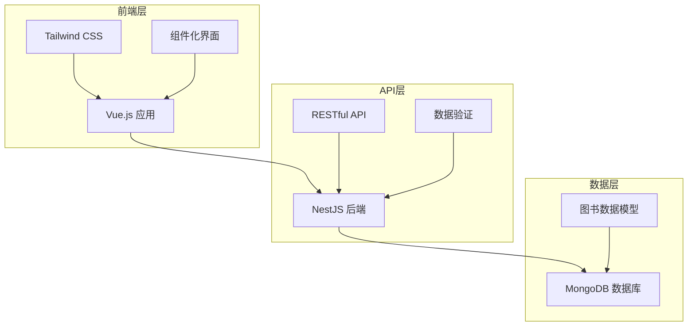

# 个人图书管理系统 - 项目规划文档

## 项目概述

### 项目名称
个人图书管理系统 (Personal Book Management System)

### 项目背景
随着个人图书收藏的不断增加，需要一个简单高效的系统来管理图书信息，记录阅读状态和个人评价，方便随时查看和管理自己的图书收藏。

### 项目目标
- 提供简单易用的图书管理界面
- 实现图书信息的增删改查功能
- 支持阅读状态跟踪和个人评分
- 提供图书搜索和筛选功能

## 需求规格说明

### 功能需求

#### 核心功能
1. **图书管理**
   - 添加新图书（书名、作者、ISBN、分类等）
   - 删除图书
   - 编辑图书信息
   - 查看图书详情

2. **阅读状态管理**
   - 标记阅读状态（未读/在读/已读）
   - 记录开始阅读日期
   - 记录完成阅读日期

3. **个人评价**
   - 图书评分（1-5 star）
   - 添加个人笔记
   - 添加tag

4. **搜索与筛选**
   - 按书名搜索
   - 按作者搜索
   - 按分类筛选
   - 按阅读状态筛选

#### 用户界面需求
- 响应式设计，页面元素动态适应设备
- 使用现代代码，尽可能少vibe-coding ~~（逃……~~


## 系统架构设计

### 技术架构



### 技术栈选择

#### 前端技术
- **框架**: Vue.js 3
- **样式**: Tailwind CSS
- **构建工具**: Vite
- **语言**: JavaScript
- **状态管理**: Pinia (可选)

#### 后端技术
- **框架**: NestJS (已有)
- **数据库**: MongoDB (已有)
- **API**: RESTful API

### 数据流设计
1. 用户通过前端界面进行操作
2. 前端发送HTTP请求到后端API
3. 后端处理请求并操作数据库
4. 数据库返回结果给后端
5. 后端返回JSON响应给前端
6. 前端更新界面显示

## API接口设计

### 图书管理接口

| 方法 | 路径 | 描述 | 请求体 | 响应 |
|------|------|------|--------|------|
| GET | /books | 获取所有图书 | - | 图书列表 |
| GET | /books/:id | 获取单本图书 | - | 图书详情 |
| POST | /books | 添加新图书 | 图书信息 | 创建的图书 |
| PUT | /books/:id | 更新图书信息 | 图书信息 | 更新后的图书 |
| DELETE | /books/:id | 删除图书 | - | 删除结果 |
| GET | /books/search | 搜索图书 | 搜索关键词 | 搜索结果 |

### 数据模型

#### 图书数据结构
```json
{
  "_id": "唯一标识",
  "title": "图书标题",
  "author": "作者",
  "isbn": "ISBN号码",
  "publisher": "出版社",
  "publishDate": "出版日期",
  "category": "分类",
  "tags": ["标签1", "标签2"],
  "status": "阅读状态 (unread/reading/read)",
  "rating": "评分 (1-5)",
  "notes": "个人笔记",
  "startDate": "开始阅读日期",
  "finishDate": "完成阅读日期",
  "coverImage": "封面图片URL",
  "createdAt": "创建时间",
  "updatedAt": "更新时间"
}
```

## 前端设计

### 项目结构
```
book-management/
├── index.html              # 主页面
├── src/
│   ├── main.js             # 应用入口
│   ├── App.vue             # 根组件
│   ├── components/         # 组件目录
│   │   ├── BookCard.vue    # 图书卡片组件
│   │   ├── BookForm.vue    # 图书表单组件
│   │   ├── BookList.vue    # 图书列表组件
│   │   ├── SearchBar.vue   # 搜索栏组件
│   │   └── FilterBar.vue   # 筛选栏组件
│   ├── views/              # 页面组件
│   │   ├── Home.vue        # 首页
│   │   ├── BookDetail.vue  # 图书详情页
│   │   ├── AddBook.vue     # 添加图书页
│   │   └── EditBook.vue    # 编辑图书页
│   ├── services/           # API服务
│   │   └── bookService.js  # 图书相关API
│   ├── utils/              # 工具函数
│   │   └── helpers.js      # 辅助函数
│   └── styles/             # 样式文件
│       └── main.css        # 主样式文件
├── package.json            # 项目配置
└── vite.config.js          # Vite配置
```

### 组件设计

#### BookCard.vue - 图书卡片
- 显示图书基本信息
- 显示封面图片
- 显示阅读状态和评分
- 提供编辑和删除按钮

#### BookForm.vue - 图书表单
- 图书信息输入表单
- 表单验证
- 提交和取消按钮

#### BookList.vue - 图书列表
- 显示图书列表
- 支持网格和列表视图切换
- 分页功能

#### SearchBar.vue - 搜索栏
- 搜索输入框
- 搜索按钮
- 搜索历史记录

#### FilterBar.vue - 筛选栏
- 分类筛选
- 阅读状态筛选
- 评分筛选

### 页面设计

#### 首页 (Home.vue)
- 图书列表展示
- 搜索和筛选功能
- 添加新图书按钮

#### 图书详情页 (BookDetail.vue)
- 显示图书完整信息
- 编辑和删除功能
- 阅读状态管理

#### 添加图书页 (AddBook.vue)
- 图书信息录入表单
- 自动获取图书信息（可选）

#### 编辑图书页 (EditBook.vue)
- 预填充图书信息
- 更新图书信息

### 样式设计
- 使用Tailwind CSS构建响应式界面
- 简洁现代的设计风格
- 统一的颜色主题和字体
- 良好的间距和对齐

## 开发计划

### 开发阶段

#### 第一阶段：基础架构
- [ ] 项目初始化和环境搭建
- [ ] 基础页面结构搭建
- [ ] 后端API基础框架
- [ ] 数据库模型设计

#### 第二阶段：核心功能
- [ ] 图书列表展示
- [ ] 图书增删改查功能
- [ ] 前后端数据交互
- [ ] 基础样式和布局

#### 第三阶段：高级功能
- [ ] 搜索和筛选功能
- [ ] 阅读状态管理
- [ ] 个人评分和笔记
- [ ] 响应式设计优化

#### 第四阶段：完善和部署
- [ ] 用户体验优化
- [ ] 错误处理和验证
- [ ] 性能优化
- [ ] 项目文档完善

### 时间安排
- 总工作量：3±1周

## 技术难点和解决方案

### 预期技术难点
1. **前后端数据交互**
   - 解决方案：使用Axios进行HTTP请求，统一错误处理

2. **响应式设计**
   - 解决方案：使用Tailwind CSS的响应式类，移动优先设计

3. **状态管理**
   - 解决方案：简单状态使用组件内部状态，复杂状态使用Pinia

4. **表单验证**
   - 解决方案：前端基础验证 + 后端数据验证

### 风险评估
- **技术风险**: 低 - 使用成熟技术栈
- **时间风险**: 中 - 功能较多，需要合理时间规划
- **复杂度风险**: 低 - 项目逻辑相对简单


---

*项目规划文档版本: 1.0*  
*创建日期: 2025-12-07*  
*最后更新: 2025-12-14*